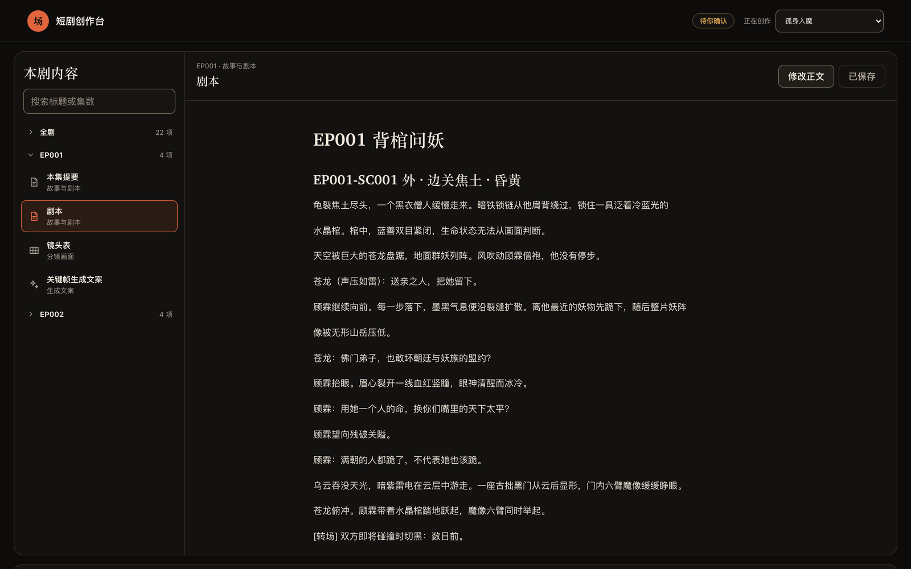
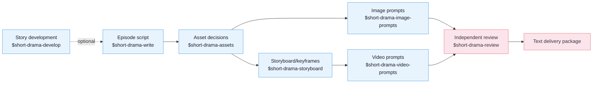

[中文](README.md) | **English**

# Drama Skills

An AI short-drama creation suite for screenwriters, motion-comic studios, and
directors. Eight skills take an idea or a long-form source all the way to episode
scripts, asset decisions, image prompts, storyboard keyframes, video prompts, and
independent review records — carrying creator decisions, source evidence, and
continuity through the entire chain. Works with Claude Code, Codex, and other
runtimes that support Agent Skills.

The output is text: scripts, asset notes, prompts, review records. The suite does
not call image, video, or audio generation services itself.

## Demo

The *Lone Fall into Demonhood* showcase adapts a mature costume-fantasy project
into project setting records, two episode scripts, twelve storyboard panels,
publicity artwork, and one 15-second vertical video — a continuous shot following
Gu Lin carrying a crystal coffin toward the border.

https://github.com/worldwonderer/drama-skills/releases/download/v0.2.0/gushenrumo-15s-demo.mp4

15.000 seconds · 720×1280 · 24 fps · H.264 + AAC, with Mandarin dialogue,
environmental sound, music, and burned-in Chinese subtitles.



That screenshot is the local project dashboard that ships with the repo — see below.

## Install

Needs **Python 3.10 or newer** (the 3.9 that ships with macOS is not enough).
Just tell Claude Code, Codex, or any agent that can import a GitHub repository:

```
Install this skill suite: https://github.com/worldwonderer/drama-skills
```

<details>
<summary>Manual linking (the eight directories must stay siblings)</summary>

```bash
git clone https://github.com/worldwonderer/drama-skills.git && cd drama-skills

# Claude Code
mkdir -p "$HOME/.claude/skills"
for skill in skills/*; do
  ln -s "$PWD/$skill" "$HOME/.claude/skills/$(basename "$skill")"
done

# Codex
mkdir -p "${CODEX_HOME:-$HOME/.codex}/skills"
for skill in skills/*; do
  ln -s "$PWD/$skill" "${CODEX_HOME:-$HOME/.codex}/skills/$(basename "$skill")"
done
```

Remove any same-named skill links first — do not mix versions.

</details>

Invocation differs by runtime: Claude Code uses `/short-drama`, Codex uses
`$short-drama`, and you can always drop the prefix and just describe the task in
plain language. The two forms are interchangeable in the examples below.

## Quick start

```
# 1. New project
Use $short-drama to init a vertical 9:16 urban face-slapping short-drama project

# 2. Write episode 1
Use $short-drama-write to write EP001: a delivery rider humiliated at a luxury
hotel turns out to be the group chairman

# 3. Extract assets, write prompts and storyboards
Use $short-drama-assets to extract characters/scenes/props from EP001
Use $short-drama-image-prompts to write reference prompts for accepted assets
Use $short-drama-storyboard to storyboard EP001
Use $short-drama-video-prompts to translate each authored shot into a video prompt

# 4. Independent review
Use $short-drama-review to review EP001's script and prompts
```

See [demo/](demo/) for one episode's full excerpt chain: script → asset sheets →
storyboard → video prompts.

## The eight skills



| Skill | Responsibility |
|---|---|
| `short-drama` | Init, routing, state, recovery, acceptance/review lifecycle, delivery |
| `short-drama-develop` | Traceable novel/long-form adaptation, story engine, episode map, director brief, genre & hook playbook |
| `short-drama-write` | Episode contract, causal beats, performable screenplay, and the project's accepted production dialect |
| `short-drama-assets` | Character/Look, Location/View, Prop/State, continuity decisions |
| `short-drama-image-prompts` | Reusable character/location/prop reference prompts and scoped edit instructions |
| `short-drama-storyboard` | Source coverage, motivated shots, staging/continuity boundaries, and frozen keyframe prompts |
| `short-drama-video-prompts` | Ordered action, performance, camera/audio intent, timing, and exact start/end continuity |
| `short-drama-review` | Structural validation, evidence-based review, production quality gates, independent verdicts |

`$short-drama` is the entry router: it initializes, resumes, recovers, and delivers
projects, dispatching the actual work to the matching skill. An existing screenplay
can enter normalization or asset extraction directly; an idea or long-form source
enters through story development.

The two image-prompt paths have distinct ownership: `image-prompts` writes
**reusable reference** prompts for characters, locations, and props, while
`storyboard` writes **keyframe** prompts representing each shot's start state.

## Local project dashboard

One line inside your agent (Codex writes `$short-drama dashboard`):

```
/short-drama dashboard
```

The skill picks the project, allocates a loopback port, and opens the browser. The
dashboard browses and lightly edits project text, previews images and video
read-only, and shows project status. It runs locally only, and needs macOS or Linux.
