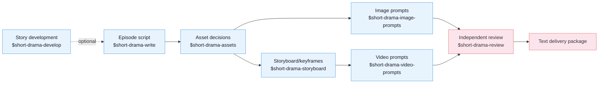

[中文](README.md) | **English**

# Drama Skills

An AI short-drama creation suite for screenwriters, motion-comic studios, and
directors. It develops an idea or long-form source into episode scripts, asset
decisions, image prompts, storyboards/keyframes, video prompts, and independent
review records, while carrying creator decisions, source evidence, and
continuity through the entire chain. It works with Claude Code, Codex, and other
runtimes that support Agent Skills.

The current release delivers scripts, asset notes, storyboards, prompts, review
records, and structured text. It does not call image, video, or audio generation services.

## Core ideas

Three principles run through the whole chain:

> 1. **A script delivers performable, producible facts.** Prefer action,
>    evidence, blocking, and dialogue strategy; use VO/OS, screen text, or
>    performance notes only when the creator deliberately chooses them.
> 2. **Assets own identity and state; storyboards own the current presentation.**
>    Reference-sheet layout, background, and view count follow the project's
>    reuse job, so each composition serves an explicit downstream purpose.
> 3. **Continuity is explicit engineering.** Compare authoritative shot
>    boundaries exactly, then repeat only the local anchors execution needs and
>    use project records as the shared memory across stages.

Above those three sits a **four-tier rule system** (structural invariant /
reviewed invariant / craft default / taste option) that separates deterministic
file and contract checks from evidence-based craft review and creator-owned style
choices.

Genre playbooks choose craft by pressure source, character strategy, audience
payoff, and production load. A production-form card then translates live action,
2D motion comics, stylized 3D, ink work, and other directions into shape, layers,
material, light, action, and sound across writing, assets, storyboards, and prompts.

## Each skill is self-contained

The eight skills install as siblings but **never read each other's files**. Shared
material is inlined as per-stage slices: every child skill's
`references/stage-contract.md` carries its own runtime preflight, ownership boundary,
what it needs from the production form, and the full rule table for that stage. The
router dispatches by skill name only; it does not pick references on a child's behalf.

The cost is that one `CON-*` continuity rule is restated in assets, storyboard, and
video-prompts. Tests enforce that all three copies keep identical classification and
wording, so changing one means changing three.

## Production chain



`$short-drama` is the entry router: it initializes, resumes, recovers, and
delivers projects, dispatching the actual work to the matching skill. An
existing screenplay can enter normalization or asset extraction directly, while
an idea or long-form source enters through story development.

There are two image-prompt paths with distinct ownership. `$short-drama-image-prompts`
writes reusable prompts for **asset references** (characters, locations, and
props). `$short-drama-storyboard` writes **shot keyframe prompts** representing
each authored shot's start state. Both share accepted asset facts while keeping
reusable design decisions separate from shot-specific presentation.

## Skills

| Skill | Responsibility |
|---|---|
| `short-drama` | Init, routing, state, recovery, acceptance/review lifecycle, delivery |
| `short-drama-develop` | Traceable novel/long-form adaptation, story engine, episode map, director brief, genre & hook playbook |
| `short-drama-write` | Episode contract, causal beats, performable screenplay, and the project's accepted production dialect |
| `short-drama-assets` | Character/Look, Location/View, Prop/State, continuity decisions |
| `short-drama-image-prompts` | Reusable character/location/prop reference prompts and scoped edit instructions |
| `short-drama-storyboard` | Source coverage, motivated shots, staging/continuity boundaries, and frozen keyframe prompts |
| `short-drama-video-prompts` | Ordered action, performance, camera/audio intent, timing, and exact start/end continuity |
| `short-drama-review` | Structural validation, evidence-based review, production quality gates, independent verdicts |

## Finished-video and dashboard demo

The *Lone Fall into Demonhood* showcase adapts a mature costume-fantasy project
into project setting records, two episode scripts, twelve storyboard panels,
publicity artwork, and one 15-second vertical video. The continuous shot follows
Gu Lin carrying a crystal coffin toward the border and includes Mandarin dialogue,
environmental sound, music, and burned-in Chinese subtitles.

**Online video (15 seconds, native audio, burned-in Chinese subtitles)**

https://github.com/worldwonderer/drama-skills/releases/download/v0.2.0/gushenrumo-15s-demo.mp4

- **Video specification:** 15.000 seconds, 720×1280, 24 fps, H.264 + AAC
- **Project dashboard:** Chinese project folders, text editing, media preview, and project status


## Install

The deterministic scripts need **Python 3.10 or newer** (check with
`python3 --version`). An older interpreter is told so directly rather than
failing inside an import. The 3.9 that ships with macOS is not enough.

**Option 1** — just tell Claude Code / Codex or any agent that can import a
GitHub repository:

```
Install this skill suite: https://github.com/worldwonderer/drama-skills
```

**Option 2** — manual linking (the eight directories must stay siblings):

```bash
git clone https://github.com/worldwonderer/drama-skills.git && cd drama-skills

# Claude Code
mkdir -p "$HOME/.claude/skills"
for skill in skills/*; do
  ln -s "$PWD/$skill" "$HOME/.claude/skills/$(basename "$skill")"
done

# Codex
mkdir -p "${CODEX_HOME:-$HOME/.codex}/skills"
for skill in skills/*; do
  ln -s "$PWD/$skill" "${CODEX_HOME:-$HOME/.codex}/skills/$(basename "$skill")"
done
```

Remove any same-named skill links first — do not mix versions. Start from the
router skill; specific tasks can also invoke the matching skill directly.

### Invocation differs by runtime

| Runtime | How to invoke |
|---|---|
| Claude Code | `/short-drama`, `/short-drama-write`, … — or just describe the task in plain language |
| Codex | `$short-drama`, `$short-drama-write`, … |
| Other Agent Skill runtimes | Follow that runtime's skill-invocation convention, or describe the task in plain language |

Examples below use the `$` form; in Claude Code replace `$` with `/`, or drop the
prefix and state the task directly.

## Quick start

```
# 1. New project
Use $short-drama to init a vertical 9:16 urban face-slapping short-drama project

# 2. Write episode 1 around character choice, a local result, and exact handoff
Use $short-drama-write to write EP001: a delivery rider humiliated at a luxury
hotel turns out to be the group chairman

# 3. Assets; optionally run asset-reference prompts and storyboard keyframes in
#    parallel, then write video prompts
Use $short-drama-assets to extract characters/scenes/props from EP001
Use $short-drama-image-prompts to write reference prompts for accepted assets
Use $short-drama-storyboard to storyboard EP001
Use $short-drama-video-prompts to translate each authored shot into a video prompt

# 4. Independent review
Use $short-drama-review to review EP001's script and prompts
```

## Local project dashboard

The repository includes a zero-production-dependency local dashboard for projects
identified by `short-drama.json`. It groups the real filesystem into Project Text,
Publicity Assets, and Reference Inputs; edits Markdown, JSON, JSONL, TXT, SRT, and ASS; and
previews common image and video formats read-only. Safe Markdown/structured-data
preview is the default, files are grouped with domain counts, lifecycle machine
states become creator-facing checkpoint/recovery/delivery cards, and media labels
distinguish visual assets, motion previs, and generated footage awaiting review:

```bash
python3 skills/short-drama/scripts/dashboard_server.py --workspace /path/to/projects --open
# The script prints and opens the complete local URL for this session
```

In Codex, invoke `$short-drama dashboard` directly. The skill selects the current
project or workspace, allocates an available loopback port, and opens the browser.

The server only binds to loopback. Text saves use SHA-256 version checks and atomic
replacement so two tabs cannot silently overwrite each other. JSON and JSONL are
validated in both browser and server before replacement. Each launch creates a
separate capability and API path. The URL fragment establishes an
`HttpOnly`, same-site browser session, and project APIs require that session.
`short-drama.json`, `.short-drama/**`, and `交付/**` remain read-only; symlinks and paths outside the
project root are rejected. The dashboard requires the secure directory-FD support
available on macOS/Linux; on an unsupported platform the server refuses to start
rather than falling back to race-prone path operations. The dashboard never connects to a
creator database or sends media-generation credentials to the browser.

See [demo/](demo/) for a creator-facing excerpt chain: one episode's script →
asset sheets → storyboard → video prompts.
