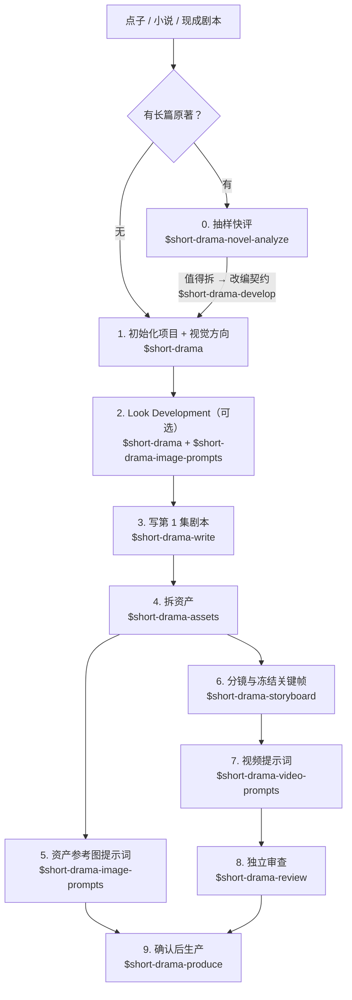

# 漫剧创作全流程指引

这份指引回答一个被反复问到的问题：**手上有一个点子或一部小说，想用这套技能做一部
竖屏漫剧，十个技能按什么顺序调用、每一步产出什么、卡住了去哪查**。它把
[README](../README.md) 的快速开始展开成一条可照做的路径，不新增任何规则——每一步的
权威做法仍在对应技能的 `SKILL.md` 里，本文只做路由与串联。

适用前提：已按 README 安装技能；运行环境支持 Agent Skill 规范（Claude Code、Codex 等）。
下文示例用 `$` 前缀写法，`/short-drama` 写法等价。

## 全流程一览



关键顺序只有两条硬约束：**资产先于分镜**（镜头要绑定已接受的人物 / 场景 / 道具版本），
**确认先于生产**（任何图片 / 视频任务都要先看到准确预览并明确确认）。其余步骤可按项目
裁剪：无原著跳过第 0 步，视觉语言简单跳过第 2 步，只做静态漫剧（关键帧 + 配音）跳过
第 7 步。

## 第 0 步：有原著时先快评（可选）

```
用 $short-drama-novel-analyze 快评 输入/小说.txt，先告诉我值不值得拆
```

抽样判断改编密度与风险，值得拆再由 `$short-drama-develop` 建立分析层与分集候选。
手上已是多集完整剧本时，跳过快评，直接让 `$short-drama-develop` 按文件实际结构生成分集
地图、逐集切片——不要把整稿一次性塞进上下文。

## 第 1 步：初始化项目并定视觉方向

```
用 $short-drama 初始化一个都市逆袭题材的竖屏漫剧项目，9:16
```

初始化时在 `short-drama.json` 里声明两件事，后面每一步都依赖它们：

- **制作形态**：漫剧 / 二维漫画。它决定各阶段可执行的词汇（线条、表面处理、材质对光的
  响应），不决定身份与剧情。
- **语言政策**：创作者可读文本跟随 `#/language`；提示词正文跟随
  `#/format/prompt_language`（未指定为 `en`）。两者独立，不要用一个推断另一个。

常见卡点：视觉方向停留在 `unset` 时，下游技能会向你给选项而不是替你选——这是刻意的，
不要用默认审美冒充已接受形态。

## 第 2 步：Look Development（可选但推荐）

```
用 $short-drama 做 Look Development，再由 $short-drama-image-prompts 写人物/地点/高压力风格帧提示词
```

把已接受视觉方向投影成代表性风格帧，先验证"这个方向画出来到底什么样"，再大规模写资产
与分镜提示词。漫剧项目最容易在这里省钱、在后面返工：画风在分镜阶段才漂移，改的是几十张
关键帧。

## 第 3 步：写第一集剧本

```
用 $short-drama-write 写第 1 集：外卖员在高档餐厅被经理羞辱，亮出集团董事身份
```

产物是 `剧集/<EP>/screenplay.md` 与稳定索引 `screenplay-index.jsonl`。之后所有阶段按
**块 ID** 引用剧本，不按正文——正文会一直改，块 ID 不变。

## 第 4 步：拆资产

```
用 $short-drama-assets 从第 1 集拆人物/场景/道具
```

产出人物 / 造型、地点 / 视图、道具 / 状态的精确 ID 与版本。这一步是后续所有提示词的
事实来源：分镜和关键帧只**绑定**这些 ID，不复述完整外观描述。

## 第 5 步：资产参考图提示词

```
用 $short-drama-image-prompts 为已接受的资产写参考图提示词
```

按"用途 → 识别点 → 构图 → 材质 / 光线 → 文字政策 → 排除项"组织，重要事实先于审美词。
漫剧形态下的选词可以复用与分镜同一套三层结构（场景 / 主体 → 风格 → 质量），见
[漫剧关键帧风格与质量词表](../skills/short-drama-storyboard/references/comic-keyframe-lexicon.md)
的"资产参考图"一节。

## 第 6 步：分镜与冻结关键帧

```
用 $short-drama-storyboard 给第 1 集做分镜：先确认原文落实，再写镜头与关键帧
```

一轮处理一个场次：先确认每段原文由谁落实（覆盖表），再写镜头目的与起止边界，最后默认
每镜一个冻结关键帧。关键场次可以先比较导演方案（Coverage Audition）再做正式分镜。

写关键帧 `generic_prompt` 时，漫剧形态的风格词与质量词从
[漫剧关键帧风格与质量词表](../skills/short-drama-storyboard/references/comic-keyframe-lexicon.md)
按镜头类型挑选：叙事关键帧、对话镜头（中近景）、动作 / 特效帧各有一张表。词表全部
是 `taste_option`，事实先于审美词的优先级不变。

写完跑结构检查（时长账目与关键帧边界是纯记账，交给脚本，不用人工目测）：

```bash
python3 <skill-dir>/scripts/storyboard_check.py 剧集/EP001/storyboard/coverage.json \
  --shots 剧集/EP001/storyboard/shots.jsonl \
  --keyframes 剧集/EP001/storyboard/keyframes.jsonl \
  --screenplay-index 剧集/EP001/screenplay-index.jsonl \
  --project short-drama.json
```

## 第 7 步：视频提示词

```
用 $short-drama-video-prompts 把第 1 集分镜逐镜翻译成视频提示词
```

关键帧只写冻结瞬间；"先、再、最后"、表情变化过程与运镜过程都在这一步写成时间变化。
只做静态漫剧（关键帧切换 + 配音）时本步可跳过，直接进审查。

## 第 8 步：独立审查

```
用 $short-drama-review 审查第 1 集的剧本与提示词
```

最好由未参与当前版本创作的人或上下文执行；条件不允许时诚实标注自检，不伪造隔离证明。

## 第 9 步：确认后生产

```
用 $short-drama-produce 预览第 1 集已接受的图片、视频任务；等我确认后再执行
```

生产技能展示本次准确数量、内容、参考、参数、输出路径与 adapter，**看到预览并明确确认后
才执行**。任何内容或直接输入变化都会让确认失效；失败任务不能无确认重试。供应商凭据不进
项目文件。

## 为什么流程是这样设计的

- **提示词与供应商解耦**：文生图 / 文生视频产品迭代以月计，主流产品的中文语义理解、
  分辨率与风格支持差异一直在变。绑定单一供应商语法的提示词会随模型换代快速贬值；
  通用提示词 + 生产环节的可选 adapter，让项目文件在换模型时不需要重写。
- **结构化规格先于渲染文本**：规格（JSONL）是唯一事实来源，Markdown 提示词是派生文本。
  直接手写提示词的项目，改资产时要靠记忆同步几十处文本；规格化的项目改一处、重新渲染。
- **确认门禁在生产之前**：图片 / 视频生成按张 / 按秒计费，且结果不可预测。"先预览准确
  任务、明确确认、再执行"把返工挡在付费之前，也让每次生成都可归属到某次确认。
- **事实先于审美词**：主流文生图产品普遍内置上百种风格预设，"8K、电影感"人人会写，
  真正决定漫剧可剪辑性的是身份、空间与连续性事实——所以每个技能的配方都把事实写在
  风格词之前，风格词表只做补充。

## 常见卡点速查

| 症状 | 去哪查 |
|---|---|
| 不知道手上的小说 / 剧本该从哪个技能进 | 本文第 0–1 步；或 README"快速开始" |
| 视觉方向 `unset`，下游不肯替我做主 | 第 1–2 步：先由创作者接受一个方向 |
| 同一项目不同集的画风用词漂移 | [漫剧关键帧风格与质量词表](../skills/short-drama-storyboard/references/comic-keyframe-lexicon.md) |
| 关键帧里写出了动作过程 / 运镜 | 冻结帧只写瞬间；时间变化交给第 7 步 |
| 改了一处资产，提示词全部过期 | 资产是事实来源：改资产 → 重渲染派生文本，不手改 Markdown |
| 想直接生成图片 / 视频 | 第 9 步：确认门禁在生产之前，凭据不进项目 |
