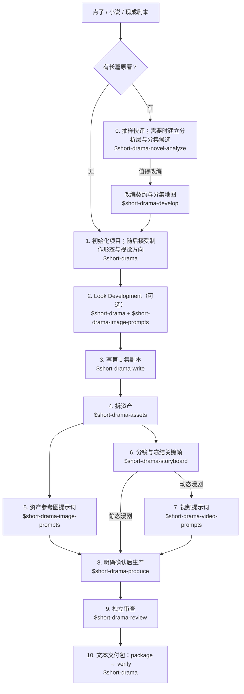

# 漫剧创作全流程指引

这份指引回答一个被反复问到的问题：**手上有一个点子或一部小说，想用这套技能做一部
竖屏漫剧，十个技能按什么顺序调用、每一步产出什么、卡住了去哪查**。它把
[README](../README.md) 的快速开始展开成一条可照做的路径，不新增任何规则——每一步的
权威做法仍在对应技能的 `SKILL.md` 里，本文只做路由与串联。

适用前提：已按 README 安装技能；运行环境支持 Agent Skill 规范（Claude Code、Codex 等）。
下文示例用 `$` 前缀写法，`/short-drama` 写法等价。

## 全流程一览



守住三条顺序：**资产先于分镜**，**确认先于生产**，**审查先于文本交付**。其余按项目
裁剪：无原著跳过第 0 步，视觉语言简单跳过第 2 步，只做静态漫剧（关键帧 + 配音）跳过
第 7 步。

## 第 0 步：有原著时先快评（可选）

```
用 $short-drama-novel-analyze 快评 输入/小说.txt，先告诉我值不值得拆
```

先抽样判断改编密度与风险；值得拆时，仍由 `$short-drama-novel-analyze` 建立可追溯分析层与
分集候选，再由 `$short-drama-develop` 把候选变成已接受的改编契约与分集地图。

手上已是多集完整剧本时，不做小说快评；直接让 `$short-drama-develop` 按文件实际结构生成
分集地图、逐集切片——不要把整稿一次性塞进上下文。

## 第 1 步：初始化项目，再接受制作形态与视觉方向

```
用 $short-drama 初始化一个都市逆袭题材的竖屏漫剧项目，9:16
```

`init` 只建立标题、项目语言、提示词语言、画幅与最小目录。初始化完成时，制作形态与视觉方向
都保持 `unset`；不要直接手改 `short-drama.json`。

接着让 `$short-drama` 给出制作形态与视觉方向的可观察选项。创作者作出选择后，先把决定发布并
接受为创作者决策，再用 `set-authority` 写回：

- **制作形态**：漫剧 / 二维漫画。它决定线条、表面处理、材质对光的响应等阶段词汇，
  不决定角色身份与剧情。
- **视觉方向**：说明跨人物、地点和镜头都要保留的线条、色层、阴影边缘、材质与空间选择，
  不能只留一个画风名称。
- **语言政策**：创作者可读文本跟随 `#/language`；提示词正文跟随
  `#/format/prompt_language`（未指定为 `en`）。两者独立，不要用一个推断另一个。

常见卡点：视觉方向停留在 `unset` 时，下游技能会向创作者给选项，而不会替创作者接受——
这是权限边界，不是流程卡死。

## 第 2 步：Look Development（可选但推荐）

```
用 $short-drama 做 Look Development，再由 $short-drama-image-prompts 写人物/地点/高压力风格帧提示词
```

把候选视觉方向投影成代表性风格帧规格，比较人物识别、地点层级与高压力场面之后，再由创作者
接受可观察的稳定项与可变量。选择写入
`short-drama.json#/creator_authority/visual_direction/choices/look_development`，后续资产与
分镜提示词读取同一条记录；不要到新一集再回词表重选画风。

本阶段只产出规格和提示词。需要实际出图时仍由 `$short-drama-produce` 展示准确任务并取得确认。

## 第 3 步：写第一集剧本

```
用 $short-drama-write 写第 1 集：外卖员在高档餐厅被经理羞辱，亮出集团董事身份
```

产物是 `剧集/<EP>/screenplay.md` 与稳定索引 `screenplay-index.jsonl`。之后各阶段通过
**块 ID** 引用剧本，不按正文行定位。修订时，内容没变的块保留 ID；被改写的块换新 ID 并
永久退役旧 ID，拆分或合并存在歧义时必须显式重映射。

## 第 4 步：拆资产

```
用 $short-drama-assets 从第 1 集拆人物/场景/道具
```

产出人物 / 造型、地点 / 视图、道具 / 状态的精确 ID 与版本。这一步是后续所有提示词的
事实来源：分镜和关键帧只**绑定**这些 ID，不复述完整外观描述。

## 第 5 步：资产参考图提示词

```
用 $short-drama-image-prompts 为已接受的资产写参考图提示词
```

先绑定用途、主体和稳定锚点，再补版本差异、构图尺度、材质光线、背景 / 舞台、文字政策与
针对性排除。重要事实先于审美词。风格只投影第 2 步已接受的视觉方向；分辨率、供应商控制词
与固定质量词尾留给制作配置，不写进通用资产提示词。

## 第 6 步：分镜与冻结关键帧

```
用 $short-drama-storyboard 给第 1 集做分镜：先确认原文落实，再写镜头与关键帧
```

一轮处理一个场次：先确认每段原文由谁落实（覆盖表），再写镜头目的与起止边界，最后默认
每镜一个冻结关键帧。关键场次可以先比较导演方案（Coverage Audition）再做正式分镜。

写关键帧 `generic_prompt` 时，从
[漫剧关键帧视觉词表](../skills/short-drama-storyboard/references/comic-keyframe-lexicon.md)
读取项目级共享画风，并按叙事关键帧、对话镜头或动作 / 特效帧补当前帧需要的表现与可读性
约束。词表全部是 `taste_option`；只有已接受进视觉方向的选择才需要稳定投影。

写完跑结构检查（时长账目与关键帧边界是纯记账，交给脚本，不用人工目测）：

```bash
python3 <skill-dir>/scripts/storyboard_check.py 剧集/EP001/storyboard/coverage.json \
  --shots 剧集/EP001/storyboard/shots.jsonl \
  --keyframes 剧集/EP001/storyboard/keyframes.jsonl \
  --screenplay-index 剧集/EP001/screenplay-index.jsonl \
  --project short-drama.json
```

## 第 7 步：视频提示词（动态漫剧）

```
用 $short-drama-video-prompts 把第 1 集分镜逐镜翻译成视频提示词
```

关键帧只写冻结瞬间；“先、再、最后”、表情变化过程与运镜过程都在这一步写成时间变化。
只做静态漫剧（关键帧切换 + 配音）时本步可跳过，关键帧与图片提示词可直接进入生产预览。

## 第 8 步：明确确认后生产

```
用 $short-drama-produce 预览第 1 集已接受的图片、视频任务；等我确认后再执行
```

生产技能展示本次准确数量、内容、参考、参数、输出路径与 adapter，**看到预览并明确确认后
才执行**。任何内容或直接输入变化都会让确认失效；失败任务不能无确认重试。供应商凭据不进
项目文件。

## 第 9 步：独立审查

```
用 $short-drama-review 审查第 1 集的剧本、提示词与已有生产观察
```

最好由未参与当前版本创作的人或上下文执行；条件不允许时诚实标注自检，不伪造隔离证明。
有授权生产观察时，审查把问题绑定到准确的 prompt、spec、reference 与制作配置，形成
`production_outputs` 与 `project_calibration` 范围内的项目级结论；reviewer 只给证据和修改
请求，内容仍由原 owner 修订。

## 第 10 步：打包并校验文本交付

```
用 $short-drama 把第 1 集已批准的文本与 JSON 打成交付包，并运行 verify
```

`package` 只收录创作者明确选择、当前状态为 `approved` 的文本 / JSON，并记录有意省略项；
二进制媒体、非公开输入、凭据、绝对路径与未批准草稿不进入文本交付包。`verify` 重新计算
清单和校验和，发现缺失、篡改或未登记新增文件。已生产媒体留在项目制作目录，需要时另做
创作者批准的媒体交接。

## 为什么这样串联

- **提示词与供应商解耦**：通用提示词留在项目，供应商语法、参数和 adapter 留在生产环节。
- **规格先于渲染文本**：对图片 / 视频提示词，结构化规格是来源，Markdown 是可重新渲染的视图；
  资产变化时改规格再渲染，不靠人工同步多份正文。
- **确认、审查与交付分开**：生产前确认准确任务，生产后按当前文本与观察审查，交付包只收当前
  已批准结果。
- **事实先于视觉语言**：画风词不说明角色身份、空间和持物；先写这些事实，再投影已接受方向。

## 常见卡点速查

| 症状 | 去哪查 |
|---|---|
| 不知道手上的小说 / 剧本该从哪个技能进 | 本文第 0–1 步；或 README“快速开始” |
| 初始化后制作形态 / 视觉方向仍是 `unset` | 第 1 步：发布并接受创作者决策，再用 `set-authority` 写回 |
| 同一项目不同集的画风用词漂移 | 第 2 步，并查看[漫剧关键帧视觉词表](../skills/short-drama-storyboard/references/comic-keyframe-lexicon.md) |
| 关键帧里写出了动作过程 / 运镜 | 冻结帧只写一个边界瞬间；时间变化交给第 7 步 |
| 改了一处资产，提示词全部过期 | 资产是事实来源：改资产 → 重渲染派生文本，不手改 Markdown |
| 想直接生成图片 / 视频 | 第 8 步：先看准确预览并明确确认，凭据不进项目 |
| 生产后不知道怎么结束项目 | 第 9–10 步：审查当前版本，再 `package` 并 `verify` 文本交付包 |
